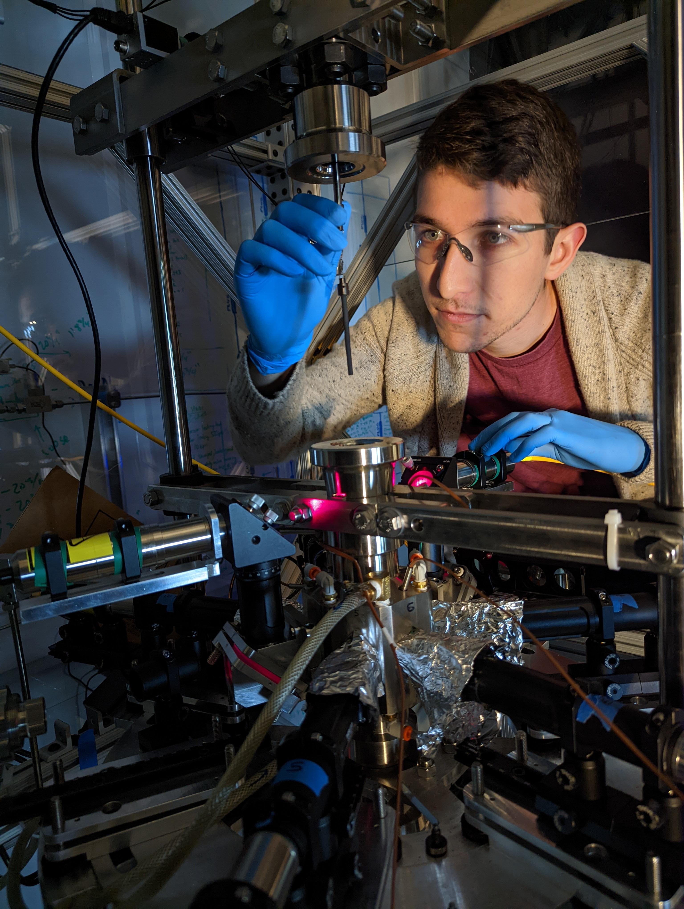

I obtained my Ph.D. in Materials in 2025 from the [University of California, Santa Barbara](https://www.materials.ucsb.edu/), where I worked in the [Wilson Group](https://labs.materials.ucsb.edu/wilson/stephen/). Prior to arriving at UCSB, I completed my B.S. in Chemical Engineering at [UCLA](https://samueli.ucla.edu/), where I concurrently interned for several years in the [Advanced Thermoelectric Materials Group](https://www.youtube.com/watch?v=47UotH8-9VU) at NASA's [Jet Propulsion Laboratory (JPL)](https://www.jpl.nasa.gov/). During that time, I also interned briefly in the alkylation plant at the [Chevron El Segundo Refinery](https://elsegundo.chevron.com/) and in the [Kauzlarich Lab](https://chemistry.ucdavis.edu/people/susan-kauzlarich) at [UC Davis](https://chemistry.ucdavis.edu/). After graduating from UCLA, I worked for a few months in the Materials Engineering, Test, & Evaluation Group at JPL and then interned briefly in the [Thin Film Material Science and Processing Group](https://www.nrel.gov/materials-science/thin-film.html) at the [National Renewable Energy Laboratory](https://www.nrel.gov/index.html).

### Employment

- **Rice University** (2025 - Present)
  - Postdoctoral Research Associate, Advised by <a href="https://pdai.phys.rice.edu/">Prof. Pengcheng Dai</a> and <a href="https://morosan.rice.edu/">Prof. Emilia Morosan</a>

### Education
- **University of California, Santa Barbara** (2019 - 2025)
  - Ph.D. Materials, Advised by <a href="https://labs.materials.ucsb.edu/wilson/stephen/">Prof. Stephen Wilson</a>

- **University of California, Los Angeles** (2014 - 2018)
  - B.S. Chemical Engineering
