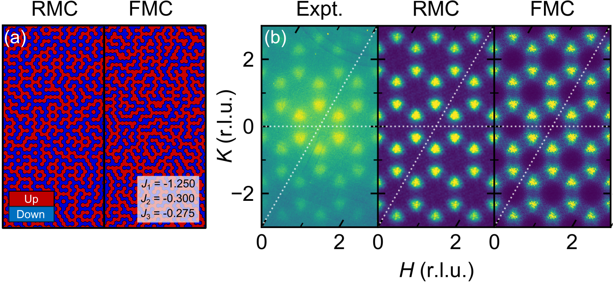
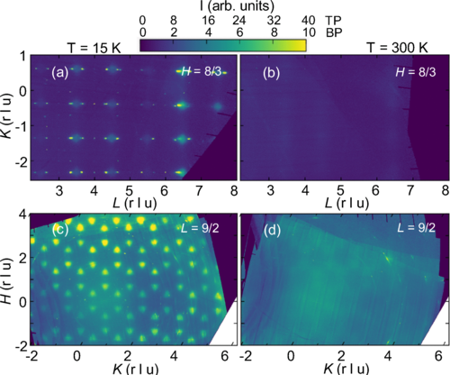

### Education
- **University of California, Santa Barbara** (2019 - 2024)
  - Ph.D. Materials, Advised by <a href="https://labs.materials.ucsb.edu/wilson/stephen/">Prof. Stephen Wilson</a>

- **University of California, Los Angeles** (2014 - 2018)
  - B.S. Chemical Engineering

### Publications
1. B. R. Ortiz, W. R. Meier, G. Pokharel, J. Chamorro, F. Yang, S. Mozaffari, A. Thaler, **S. J. Gomez Alvarado**, H. Zhang, D. S. Parker, G. D. Samolyuk, J. A. M. Paddison, J. Yan, F. Ye, S. Sarker, S. D. Wilson, H. Miao, D. Mandrus, M. A. McGuire, Stability frontiers in the $$AM_6X_6$$ kagome metals; The $$Ln$$Nb$$_6$$Sn$$_6$$ ($$Ln$$:Ce-Lu,Y) family and density-wave transition in LuNb$$_6$$Sn$$_6$$. (2024) \[[**arXiv: 2411.10635**](https://arxiv.org/abs/2411.10635)\]
   
1. **S. J. Gomez Alvarado**, G. Pokharel, B. R. Ortiz, J. A. M. Paddison, S. Sarker, J. P. C. Ruff, and S. D. Wilson, Frustrated Ising charge correlations in the kagome metal ScV$$_6$$Sn$$_6$$. *Phys. Rev. B* **110** (2024) L140304. \[[**DOI: 10.1103/PhysRevB.110.L140304**](https://doi.org/10.1103/PhysRevB.110.L140304)\] \[[**arXiv: 2407.12099**](https://arxiv.org/abs/2407.12099)\]
   
1. B. R. Ortiz, P. M. Sarte, G. Pokharel, M. J. Knudtson, **S. J. Gomez Alvarado**, A. F. May, S. Calder, L. Mangin-Thro, A. R. Wildes, H. Zhou, G. Sala, C. R. Wiebe, S. D. Wilson, J. A. M. Paddison, and A. A. Aczel, Revisiting spin ice physics in the ferromagnetic Ising pyrochlore Pr$$_2$$Sn$$_2$$O$$_7$$. *Phys. Rev. B* **109** (2024) 134420. \[[**DOI: 10.1103/PhysRevB.109.134420**](https://doi.org/10.1103/PhysRevB.109.134420)\]\[[**arXiv: 2310.16180**](https://arxiv.org/abs/2310.16180)\]
   {: style="height:350px;" }
1. **S. J. Gomez Alvarado**, E. Zoghlin, A. Jackson, L. Kautzsch, J. Plumb, M. Aling, A. N. Capa Salinas, G. Pokharel, Y. Pang, R. M. Gomez, S. Daly, and S. D. Wilson, Advances in high-pressure laser floating zone growth: The Laser Optical Kristallmacher II (LOKII). *Rev. Sci. Instrum.* **95** (2024) 033903. \[[**DOI: 10.1063/5.0186528**](https://doi.org/10.1063/5.0186528)\]\[[**arXiv: 2311.03671**](https://arxiv.org/abs/2311.03671)\]
   {: style="height:350px;" }
1. G. Pokharel, B. R. Ortiz, L. Kautzsch, **S. J. Gomez Alvarado**, K. Mallayya, G. Wu, E.-A. Kim, J. P. C. Ruff, S. Sarker, and S. D. Wilson, Frustrated charge order and cooperative distortions in ScV$$_6$$Sn$$_6$$. *Phys. Rev. Materials* **7** (2023) 104201. \[[**DOI: 10.1103/PhysRevMaterials.7.104201**](https://doi.org/10.1103/PhysRevMaterials.7.104201)\]\[[**arXiv: 2307.11843**](https://arxiv.org/abs/2307.11843)\]
   {: style="height:350px;" }
1. B. R. Ortiz, G. Pokharel, M. Gundayao, H. Li, F. Kaboudvand, L. Kautzsch, S. Sarker, J. P. C. Ruff, T. Hogan, **S. J. Gomez Alvarado**, P. M. Sarte, G. Wu, T. Braden, R. Seshadri, E. S. Toberer, I. Zeljkovic, and S. D. Wilson, YbV$$_3$$Sb$$_4$$ and EuV$$_3$$Sb$$_4$$ vanadium-based kagome metals with Yb$$^{2+}$$ and Eu$$^{2+}$$ zigzag chains. *Phys. Rev. Materials* **7** (2023) 064201. \[[**DOI: 10.1103/PhysRevMaterials.7.064201**](https://doi.org/10.1103/PhysRevMaterials.7.064201)\]\[[**arXiv: 2302.12354**](https://arxiv.org/abs/2302.12354)\]
    {: style="height:350px;" }
1. **[Editor's Suggestion]** **S. J. Gomez**, P. M. Sarte, M. Zelensky, A. M. Hallas, B. A. Gonzalez, K. H. Hong, E. J. Pace, S. Calder, M. B. Stone, Y. Su, E. Feng, M. D. Le, C. Stock, J. P. Attfield, S. D. Wilson, C. R. Wiebe, and A. A. Aczel, Absence of moment fragmentation in the mixed B-site pyrochlore Nd$$_2$$GaSbO$$_7$$. *Phys. Rev. B.* **103** (2021) 214419. \[[**DOI: 10.1103/PhysRevB.103.214419**](https://doi.org/10.1103/PhysRevB.103.214419)\]\[[**arXiv: 2104.00791**](https://arxiv.org/abs/2104.00791)\]
    {: style="height:350px;" }
1. **S. J. Gomez**, D. Cheikh, T. Vo, P. Von Allmen, K. Lee, M. Wood, G.J. Snyder, B. S. Dunn, J.-P. Fleurial, and S. K. Bux, Synthesis and Characterization of Vacancy-Doped Neodymium Telluride for Thermoelectric Applications, *Chem. Mater.* **31** (2019) 4460-4468. [<a href="https://dx.doi.org/10.1021/acs.chemmater.9b00964"><b>DOI: 10.1021/acs.chemmater.9b00964</b></a>][<a href="https://www.ncbi.nlm.nih.gov/pmc/articles/PMC6961965/"><b>PubMed Central</b></a>]
    {: style="height:350px;" }
{: reversed="reversed"}