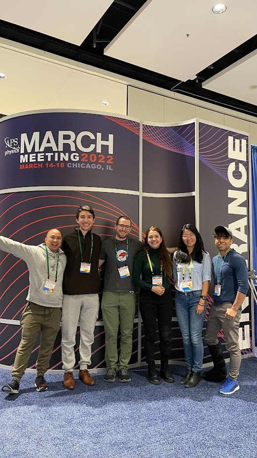

{: style="height:300px;" }
Artwork I made from the diffuse scattering, calculated 3D-$$\Delta$$PDF, simulated 3D-$$\Delta$$PDF, and simulated short-range order (background) based on my single crystal X-ray diffraction study of the *Ln*Cd$$_3$$P$$_3$$ family of compounds in collaboration with Dr. Juan Chamorro.    

---

{: style="height:300px;" }
Wilson group members past and present at the American Physical Society March Meeting 2024 in Minneapolis, MN.

---

{: style="height:300px;" }
The high-pressure laser floating zone furnace, "LOKII", for which I led development.

---

{: style="height:300px;" }
A crystal of Sr$$_2$$IrO$$_4$$ which I grew in the high-pressure laser floating zone furnace. To my knowledge, it's the largest Sr$$_2$$IrO$$_4$$ crystal in the world! 

---

{: style="height:300px;" }
My work on the high-pressure laser floating zone furnace was featured in the photography and content of the [Quantum Quest article of the UCSB Magazine](https://magazine.ucsb.edu/fall-winter-2022/quantum-quest).

---

{: style="height:300px;" }
Measuring single crystal neutron diffraction on the FIETAX beamline (HB-1A) at the [Oak Ridge National Laboratory (ORNL) High Flux Isotope Reactor (HFIR)](https://neutrons.ornl.gov/hfir)

---

{: style="height:300px;" }
Measuring single crystal X-ray diffraction on the QM$$^2$$ beamline (ID4B) at the [Cornell High Energy Synchrotron Source (CHESS)](https://www.chess.cornell.edu/users/qm2-beamline).

---

{: style="height:300px;" }
Snowflakes growing under a crystal due to the chilly He cryostream during a single-crystal X-ray diffraction measurement on the QM$$^2$$ beamline (ID4B) at the [Cornell High Energy Synchrotron Source (CHESS)](https://www.chess.cornell.edu/users/qm2-beamline).

---

{: style="height:300px;" }
A crystal of Sr$$_2$$IrO$$_4$$ wired up for a measurement of its electrical resistivity.

---

{: style="height:300px;" }
A crystal of Ga$$_2$$O$$_3$$ Dr. Ganesh Pokharel and I grew in the high-pressure laser floating zone furnace.

---

{: style="height:300px;" }
Wilson group members at the American Physical Society March Meeting 2022 in Chicago, IL.

---

{: style="height:300px;" }
Me after successfully passing my Ph.D. candidacy exam in 2022.

---
